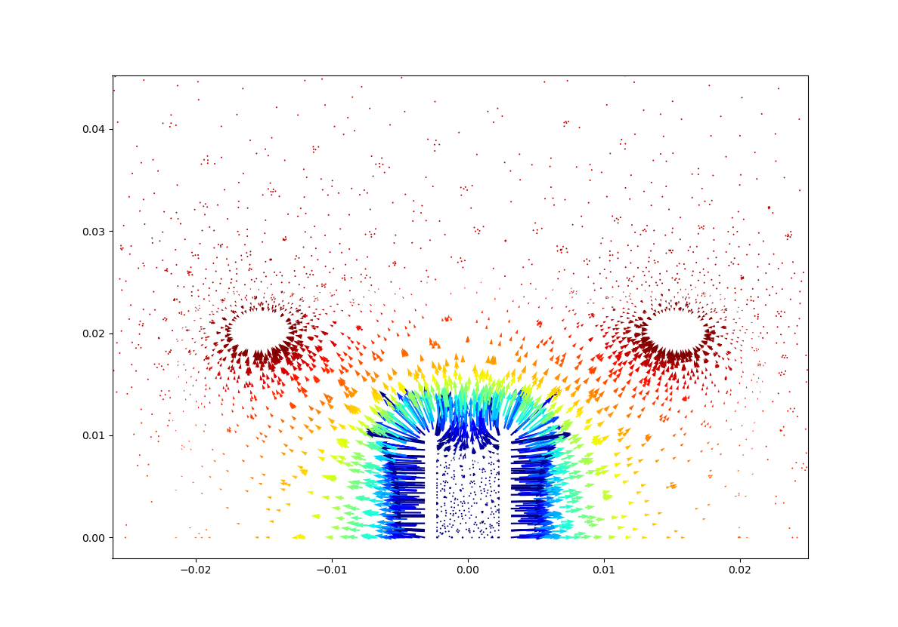

# flame_image
Mr. Susith's project on adding able transformation for images

## initial work

- [x] Bg substraction and averaging

## Process generalized height and width

- [x] Added functions to calculate the flame height
- [x] process multiple images in a sequesnce and export a csv

## Bug fixes

- added support for split flames. (Mutliple crossing events)

# Ansys-Fluent MHD

- Wrote a python script to export electric field vector plot based on values from Ansys 

